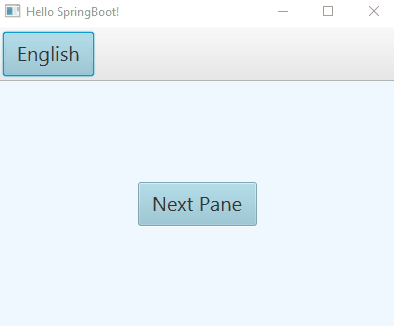

# Pane switching in JavaFx (compared with and without Spring Boot)
The application demonstrates switching of two child panes inside one parent pane. 

## Solution: Java 8 without Spring Boot
* Original source code was shamelesly taken from [this public repository](https://gist.github.com/jewelsea/6460130)
* in my master branch you can still find it [under commit](https://github.com/JinyKafe/JavaFx_pane_switching/commit/c22b7ca54e80a0fc8dfdac326db801038890bfe7)
* This solution runs with Java 8 only, because it needs the embedded JavaFX libraries.

## Solution: with JavaFX Weaver and Spring Boot
* the current code (master HEAD) combines JavaFX with Spring Boot thanks to this great framework [JavaFX-Weaver framework](https://github.com/rgielen/javafx-weaver). As you can see by comparision with original solution, the Spring dependency injection makes the code much neater. And of course, you have the power of Spring Boot inside your JavaFx proeject for free. This project is maven based and it works with the latest Java version. All JavaFX dependencies are imported in pom.xml

